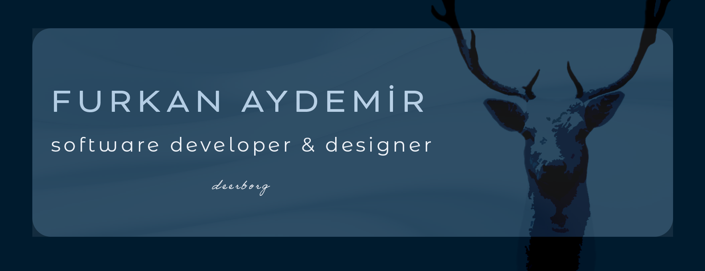

###

###

I am a software developer graduated from the Department of Maritime Business Administration and Management. I have been involved in numerous projects and conducted research and internships in this field. However, my curiosity and passion have directed me towards the world of software development. Recently, I participated in the Java Bootcamp through the Patika+ Program to enhance my skills in software development, and I continue to strive for self-improvement.

I have a strong foundation in backend technologies such as Java and Spring, and I have experience in developing modern web applications using JavaScript. Additionally, I am knowledgeable in database management, particularly SQL. I work towards solving complex problems and developing user-friendly solutions by utilizing these skills.

Furthermore, I have expanded my expertise by using Adobe Creative Cloud products. I have gained proficiency in designing and enhancing visual presentations through tools like Adobe Photoshop, Premiere Pro, Adobe XD, and Adobe After Effects. I aim to continue developing applications that prioritize user experience and visual appeal by utilizing these tools and further enhancing my skills.

**Contact:** furkanyadem1r@hotmail.com

###

  

  

###

  

